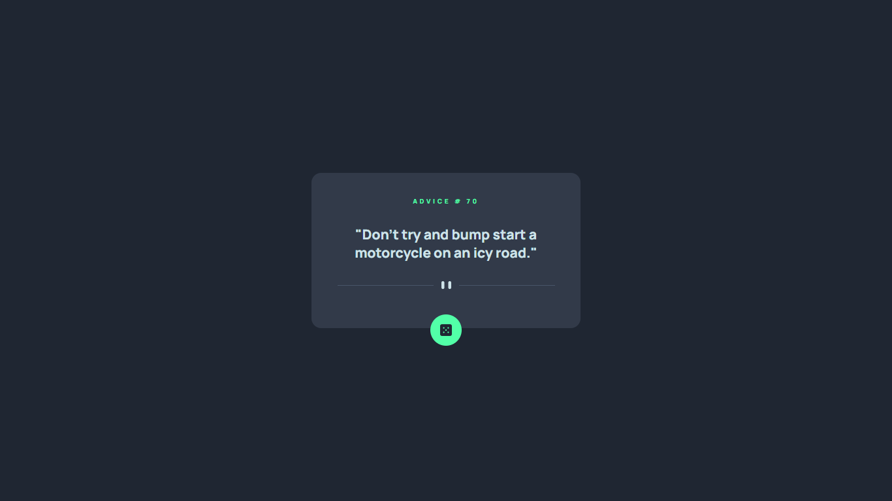

# Advice generator app

## Table of contents

- [Advice generator app](#advice-generator-app)
  - [Table of contents](#table-of-contents)
  - [Overview](#overview)
    - [Screenshot](#screenshot)
    - [Links](#links)
    - [Built with](#built-with)
  - [Author](#author)

## Overview

This is a simple advice generator app

- View the optimal layout for the app depending on their device's screen size
- See hover states for all interactive elements on the page
- Generate a new piece of advice by clicking the dice icon

### Screenshot

### Links

- [solution URL](https://github.com/ivandro-neto/advice-generator-app-main.git)
- [live site URL](https://ivandro-neto.github.io/advice-generator-app-main/)

### Built with

- Semantic HTML5 markup
- CSS custom properties
- Flexbox
- Javascript - ES6

## Author

- Github - [ivandro-neto](https://github.com/ivandro-neto)
- Frontend Mentor - [@ivandro-neto](https://www.frontendmentor.io/profile/ivandro-neto)
- Twitter - [@IvandroNeto6121](https://twitter.com/IvandroNeto6121)